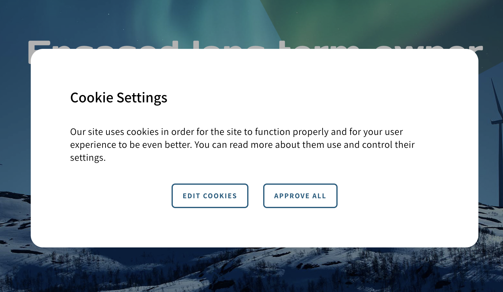
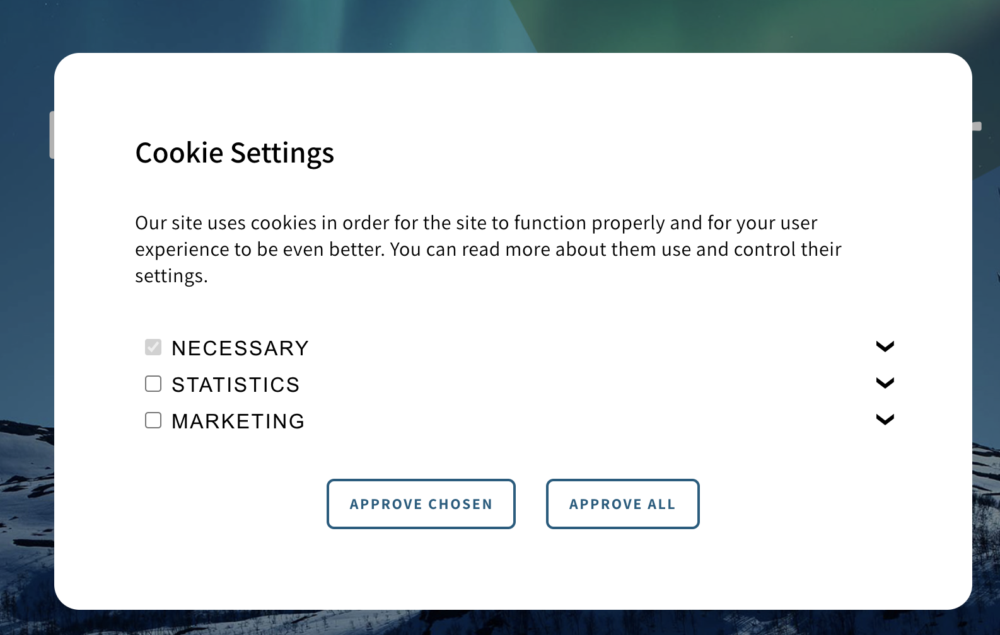
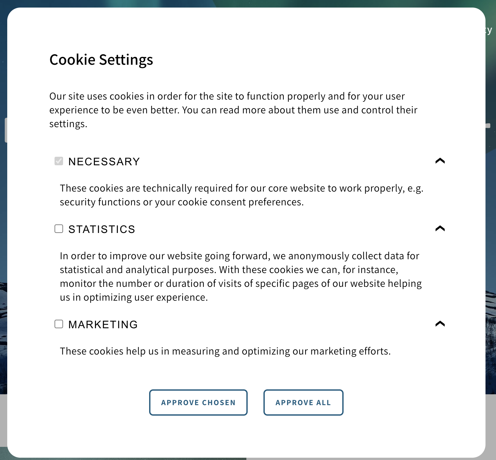

# WP GDS CMP

This plugin embeds the [GDS Consent Manager](https://gds.generogrowth.com/master/?path=/story/complex-components-consentmanager--options) tag on a wp site using a theme that has the Genero Design System.

## Installation
`composer require generoi/wp-gds-cmp`

## Requirements
genero-design-system version 4.0.0-beta.16 or higher.

## Screenshots

